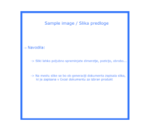

# Projekt za Hermi, d.o.o.
**Verzija:** 1.0a  
**Avtorji:**
  - Filip Lesjak
  - Jure Zavratnik
  - Tine Šuster
  
## Kazalo
   0. [Nabor predpogojev za delo z rešitvijo](https://github.com/sustertine/Praktikum-II-Hermi#predpogoji-za-delo-z-re%C5%A1itvijo)
   1. [Format Excel dokumenta](https://github.com/sustertine/Praktikum-II-Hermi/blob/master/README.md#format-excel-dokumenta)
   2. [Slike](https://github.com/sustertine/Praktikum-II-Hermi/blob/master/README.md#slike)
   3. [Kreacija predlog z značkami](https://github.com/sustertine/Praktikum-II-Hermi/blob/master/README.md#kreacija-predlog-z-zna%C4%8Dkami)
   4. [Pretvorba v PDF](https://github.com/sustertine/Praktikum-II-Hermi/blob/master/README.md#pretvorba-v-pdf)  
      4.1 [Namestiev skripta](https://github.com/sustertine/Praktikum-II-Hermi/blob/master/README.md#namestitev-skripta)
   5. [Uporaba aplikacije](https://github.com/sustertine/Praktikum-II-Hermi/blob/master/README.md#uporaba-aplikacije)  
      5.1 [Izbira vhodov](https://github.com/sustertine/Praktikum-II-Hermi/blob/master/README.md#izbira-vhodov)  
      5.2 [Branje in obdelava](https://github.com/sustertine/Praktikum-II-Hermi/blob/master/README.md#branje-in-obdelava)
   6. [Imeniška stuktura](https://github.com/sustertine/Praktikum-II-Hermi/blob/master/README.md#imeni%C5%A1ka-stuktura)

## Generator tehničnih specifikacij v obliki pdf in docx  
Aplikacija kot vhod vzame predloge v obliki .docx, slike, in .xslt(excel) dokument in na podlagi predloge vrne .docx in/ali .pdf dokument z vnešenimi podatki izbranega produkta/prodkutov iz .xslt(excel) dokumenta.

*V repozitoriju je tudi nabor testnih podatkov za razvijalce.*

## Predpogoji za delo z rešitvijo
   - Nameščena Java, priporočamo verzijo 11.0.4, ki je vključena v paket z rešitvijo. To verzijo je potrebno nastaviti kot privzeto verzijo.
   - Nameščen VBS script, po [navodilih](https://github.com/sustertine/Praktikum-II-Hermi#pretvorba-v-pdf).

## Format Excel dokumenta   
Excel dokument naj **_nima praznih stolpcev_**. Imena stolpcev so sicer lahko napisana z malimi ali velikimi tiskanimi črkami, vendar je preferečno, da so napisana z velikimi. Imena stolpcev, ki naj bodo obravanavani kot "večjezični" (tj. bodo vsebinsko enaki drugemu stolpcu le v drugem jeziku) naj bodo poimenovani tako:
- stolpec v primarnem jeziku (npr. "IME") naj bo napisan brez dodatnih pripon --> **_"IME"_**.
- ostali stolpci naj imajo dodano pripono **_"\_OKRAJŠAVA_ZA_JEZIK"_** --> **_"IME_GER"_**.
- ne glede na jezik v katerem želimo vstaviti vsebino naj se v značko ne dodaja pripone ampak jezik izberemo v aplikaciji
   - torej, če želimo izbrati nemško različico stolpca **_"IME"_** značka izgleda: **_<<#IME>>_** jezik pa se izbere preko grafičnega uporabniškega vmesnika.    
   
    

*aplikacija zazna jezike sama, če ni drugih jezikov je privzet slovenski jezik  
*za izbran jezik se v predlogo vstavijo vsi stolpci, ki podpirajo tisti jezik     

## Slike  
Povezave do slik naj bodo v stolpcu poimenovanem **__"SLIKA"__** in naj imajo kot vsebino v vsaki vrtici absolutno pot do slike. Za sliko se ne uporablja značka, ampak priložena predložna slika.  
To je namenjeno uporabniku, za boljšo vizualizacijo končnega produkta in bolj vsestransko možnost oblikovanka predloge.

## Kreacija predlog z značkami:  
Kot značke se lahko uporabljajo imena stolpcev(atributi) v vhodni .xslt(excel) datoteki. Ne glede na pisavo (velike/male črke), se naj značke vedno pišejo z **_velikim (upper-case) črkami_**.  

  

Značke naj bodo oblike **_<<#IME ATRIBUTA>>_** oz. **_<<#IME STOLPCA>>_**.
Primer uporabe značke, če želimo, da se v izhodnem dokumentu na danem mestu izpiše npr. _ime produkta_.
Kot značko vstavimo **_<<#IME PRODUKTA>>_** in aplikacija bo v izhodnem dokumentu namesto tega izpisala npr. **_A12-D_**.

Dodatni primeri uporabe:
- <<#IME PRODUKTA>> **-->** A12-D
- <<#ŠIRINA>> **-->** 12cm
- <<#PROSTORNINA>> **-->** 30cm3

**Primer preproste pravilno pripravljene predloge:**

## Pretvorba v PDF
Pretvorba v PDF je elegantno rešena preko VBS scripta. Način namestitve tega scripta omogoča integracijo z Windows OS, kar naredi uporabo skrajno preprosto. V izhodnem direktoriju, se izberejo dokumenti, ki jih želimo pretvoriti v .pdf format. Na to se preko desnega klika -> pošlji v -> izbira skripta, .pdf različice izbranih dokumentov pojavijo v istem izhodnem direktoriju.  

### Namestitev skripta
1. Priloženo doc2pdf.vbs datoteko shranite na poljubno varno mesto. Predlog: C:\\{ustvarite posebno mapo}.
2. Ustvarite bljižnico doc2pdf.vbs datoteke in jo skopirajte.  

  
3. Bljižnico premaknite na mesto: C:\Users\{uporabnisko_ime}\AppData\Roaming\Microsoft\Windows\SendTo
3.1 V primeru da ne najdete datoteke AppData: V opravilni vrstici izberite Pogled/View -> Izberite moznost pogleda skritih datotek(Hidden items)   
4. Na lokaciji C:\Users\{uporabnisko_ime}\AppData\Roaming\Microsoft\Windows\SendTo prilepite bljižnico datoteke doc2pdf.vbs
5. Izberite podrobnosti doc2pdf.vbs datoteke.  
6. Pod zavihkom "bljižnica" v polju target vstavite **wscript.exe** pred lokacijo vaše doc2pdf.vbs datoteke in shranite.
    
  
### Uporaba skripta
1. Pojdite na mesto .docx datoteke katero želite pretvoriti.
2. Izberite eno ali več datotek.
3. Po izbiri datotek izberite možnost poslji/send to in izberite doc2pdf bljiznico.

## Uporaba aplikacije:
  

Aplikacija prebere iz vhodnih direktorijev datoteke in jih izpiše v ustrezna okna.

### Izbira vhodov
Uporabnik izbere vhodni excel dokument z klikom na ime želene datoteke v seznamu. Excel ni izbran če nobena vrstica v seznamu ni obarvana temno sivo.  

Uporabnik izbere vhodno word predlogo z klikom na ime želene datoteke v seznamu. Excel ni izbran če nobena vrstica v seznamu ni obarvana temno sivo.

### Branje in obdelava
Po izbiri uporabnik klikne na gumb z napisom **"Beri excel"**. Iz izbranega vhodnega Excel dokumenta se v ustrezen seznam izpišejo vrednosti prvega stolpca iz vseh vrstic. Tukaj lahko uporabnik zbere eno ali več vrstic za obdelavo.  

Z vnosno polje iskanje lahko uporabnik vnese niz, ki se nahaj v eni ali več vrstic iz seznama. Ob kliku gumba z napisom **"Išči"** se v seznam izpišejo vse vrstice, ki vsebujejo vnešen niz. Če je polje prazno se v seznam ob kliku izpišejo spet vse vrstice iz izbranega Excel dokumenta.

Gumb z napisom **"Izberi vse"**, izbere vse vrstice v seznamu.

Gumb z napisom **"Generiraj"**, generira .docx(word) dokumente iz izbrane predloge in Excel dokumenta. Ti se izpišejo v seznamu **"Word dokumenti"**.  

Dokumenti se v .pdf pretvorijo preko VBS skripta([razloženo zgoraj](https://github.com/sustertine/Praktikum-II-Hermi/blob/master/README.md#pretvorba-v-pdf)).

Ob kliku na gumb z napison **"Osveži"** se uporabniški vmesnik osveži in v sezname se izpiše realno stanje vhodnih in izhodnih datotek.

Ob **dvojnem kliku** na katerokoli datoteki iz seznamov (razen vrstic v seznamu "Izdelki) **se datoteka odpre**. 

## Imeniška stuktura:

1. **_src:**
     - Vsebuje source kodo in pom.xml
     - **backend**:
         - vsebuje vse razrede ki delajo v ozadju
     - **hermi:**
         - vsebuje vse razrede, ki uporavljajo z vmesnikom in .fxml predstavitev vmesnika
2. **data**:
     - vsebuje .xslt(excel) vhodne datoteke
3. **img**:
     - vsebuje vhodne slikovne vire
4. **out**:
     - vsebuje izhodne .dox in.pdf dokumente
5. **templates**:
     - vsebuje vhodne predloge v obliki .docx
6. **work**:
     - je začasen delovni direktorij, kjer se v času obdelave nahaja razpakirana kopija uporabljane .docx predloge
     - ta direkorij mora biti v času, ko aplikacije ne obdeluje dokumentov prazen (za razvijalce)
